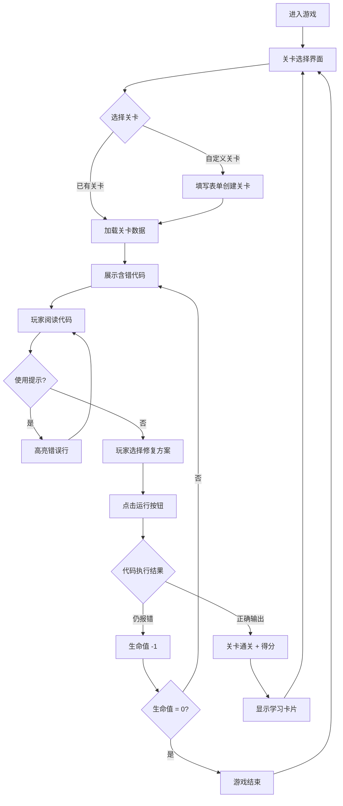

## 1. 产品概述

"语法结构"是一款面向编程初学者的解谜游戏，玩家通过识别并修复代码中的语法错误来通关。游戏以"代码医生"为隐喻——每段代码都是一个"病人"，玩家的任务是诊断并开出正确的"处方"（修复方案）。支持 Python 和 JavaScript 两种语言，内置简化代码沙盒，玩家可实时验证修复结果。

- **目标用户**：编程初学者、计算机专业学生、编程训练营学员
- **核心价值**：将枯燥的语法学习转化为有趣的解谜体验，通过"试错—修复—验证"的闭环强化学习效果

## 2. 核心功能

### 2.1 功能模块

1. **关卡选择界面**：展示所有关卡列表，包含关卡序号、难度标识、知识点标签、通关状态（未解锁/已通关/进行中）
2. **游戏主界面**：代码展示区 + 选项区 + 沙盒预览区三栏布局
3. **代码沙盒**：内置简化解释器，支持 Python 和 JavaScript 基础语法的模拟执行
4. **提示系统**：高亮代码出错行附近区域，显示错误类型提示
5. **自定义关卡**：玩家提交包含错误代码和正确答案的表单，生成新挑战
6. **学习卡片**：每个关卡对应的语法知识点说明弹窗
7. **主题切换**：暗色模式（默认）与亮色模式的编辑器风格切换

### 2.2 页面详情

| 页面名称 | 模块名称 | 功能描述 |
|---------|---------|---------|
| 关卡选择页 | 头部导航 | 显示游戏标题、得分/生命值状态、主题切换按钮 |
| 关卡选择页 | 关卡网格 | 卡片式展示各关卡，含难度星级、知识点标签、状态图标 |
| 关卡选择页 | 自定义关卡入口 | 按钮引导进入自定义关卡创建表单 |
| 游戏主界面 | 代码展示区 | 带行号的代码编辑器，错误行高亮显示，支持语法着色 |
| 游戏主界面 | 选项区域 | 4个修复方案卡片，点击选择，选中态高亮 |
| 游戏主界面 | 沙盒预览 | 控制台风格输出窗口，显示运行结果或错误信息 |
| 游戏主界面 | 控制栏 | 运行按钮、提示按钮、返回关卡列表按钮 |
| 自定义关卡页 | 表单区域 | 选择语言、输入错误代码、输入正确代码、输入知识点说明 |
| 学习卡片弹窗 | 知识点展示 | 语法知识点标题、详细说明、代码示例（正确vs错误对比） |

## 3. 核心流程

## 4. 用户界面设计

### 4.1 设计风格

- **美学方向**：复古终端 x 现代极简 — 以老式 CRT 终端美学为灵感，融合现代扁平化设计语言。默认暗色模式营造"深夜编码"氛围，亮色模式提供温暖的纸质编辑器体验。
- **主色调（暗色）**：
  - 背景：深黑 `#0a0a0a`，面板 `#1a1a2e`
  - 代码区：`#0d1117`（类 GitHub 暗色）
  - 强调色：霓虹绿 `#00ff41`（终端绿），电光蓝 `#00d4ff`，琥珀 `#ffb000`
  - 错误/危险：`#ff4757`
  - 成功：`#2ed573`
- **主色调（亮色）**：
  - 背景：暖白 `#faf8f5`，面板 `#fffef9`
  - 代码区：`#fefcf5`（类纸张色）
  - 强调色：墨蓝 `#1a3a5c`，深绿 `#2d6a4f`
- **字体**：代码使用 JetBrains Mono，界面使用系统默认中文字体 + Space Grotesk（标题）
- **按钮风格**：带微妙边框发光的扁平按钮，hover 时边框亮度增强
- **布局风格**：桌面端三栏布局（代码区 | 选项区 | 沙盒），移动端纵向堆叠

### 4.2 页面设计概览

| 页面名称 | 模块名称 | UI 元素 |
|---------|---------|---------|
| 关卡选择页 | 整体布局 | 居中容器，顶部状态栏 + 标题，中部卡片网格（3列），底部自定义关卡入口 |
| 关卡选择页 | 关卡卡片 | 圆角卡片，左侧难度星级，右侧语言图标，底部通关状态标签，hover 上浮微动效 |
| 关卡选择页 | 顶部状态栏 | 左：得分动画数字，中：生命值心形图标 x3，右：主题切换 toggle |
| 游戏主界面 | 代码展示区 | 左侧行号列（灰色），代码区（语法着色），错误行浅红背景 + 左侧红色标记条 |
| 游戏主界面 | 选项区域 | 从上到下排列4个选项卡片，每个卡片左侧字母标识(A/B/C/D)，选中态蓝绿色边框 |
| 游戏主界面 | 沙盒预览 | 终端风格黑底绿字输出，顶部标签栏（输出/错误），滚动查看 |
| 游戏主界面 | 控制栏 | 底部固定栏，左：返回/提示按钮，中：运行按钮（主 CTA），右：知识点按钮 |
| 自定义关卡页 | 表单 | 居中卡片表单，下拉选择语言，两个大文本框（带行号），提交按钮 |
| 学习卡片弹窗 | 整体 | 居中模态弹窗，半透明遮罩，卡片内标题 + 说明 + 代码对比示例，关闭按钮 |

### 4.3 响应式设计

- **桌面端优先**（≥1024px）：三栏网格布局，代码区和沙盒并排
- **平板端**（768-1023px）：代码区和选项区上下布局，沙盒可折叠
- **手机端**（<768px）：全部纵向堆叠，关卡卡片单列，底部导航简化

## 5. 关卡设计

### 5.1 内置关卡列表（共10关）

| 关卡 | 语言 | 知识点 | 错误类型 | 难度 |
|-----|------|-------|---------|-----|
| 1 | Python | print函数基本用法 | 字符串引号未闭合 | ★ |
| 2 | JavaScript | 变量声明 | 变量未定义 | ★ |
| 3 | Python | if语句缩进 | 缩进错误 | ★★ |
| 4 | JavaScript | 函数参数括号 | 括号不匹配 | ★★ |
| 5 | Python | 列表操作 | 括号不匹配 | ★★ |
| 6 | JavaScript | for循环语法 | 缩进/括号混合错误 | ★★★ |
| 7 | Python | 字典与字符串拼接 | 引号未闭合 + 类型错误 | ★★★ |
| 8 | JavaScript | 数组方法链式调用 | undefined变量 | ★★★ |
| 9 | Python | 函数定义与调用 | 多重错误混合 | ★★★★ |
| 10 | JavaScript | 条件判断与逻辑运算 | 括号不匹配 + 未定义 | ★★★★ |