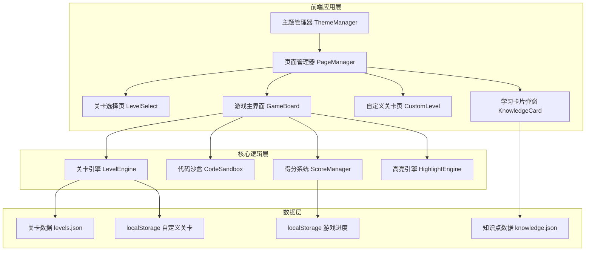

## 1. 架构设计



## 2. 技术选型

- **前端框架**：原生 HTML + CSS + JavaScript（无框架依赖，用户指定）
- **代码高亮**：自研轻量语法高亮器（基于正则匹配），无需引入 Prism.js 或 highlight.js
- **代码沙盒**：自研简化 Python/JavaScript 解释器，覆盖基础语法（变量、条件、循环、函数调用、print/console.log）
- **图标**：内联 SVG 图标，无外部依赖
- **数据存储**：localStorage 持久化游戏进度和自定义关卡
- **部署**：纯静态文件，任意 HTTP 服务器即可托管

## 3. 文件结构

```
/
├── index.html              # 入口页面，挂载单页应用
├── css/
│   ├── main.css            # 全局样式、CSS 变量、主题定义
│   ├── level-select.css    # 关卡选择页样式
│   ├── game-board.css      # 游戏主界面样式
│   ├── custom-level.css    # 自定义关卡页样式
│   └── components.css      # 通用组件样式（按钮、弹窗、卡片等）
├── js/
│   ├── app.js              # 应用入口，路由管理，页面切换
│   ├── theme.js            # 主题切换逻辑
│   ├── level-engine.js     # 关卡数据加载、验证、进度管理
│   ├── code-sandbox.js     # 简化代码沙盒执行引擎
│   ├── syntax-highlight.js # 语法高亮与错误行标记
│   ├── score-manager.js    # 得分与生命值管理
│   ├── level-data.js       # 内置关卡与知识点数据
│   └── custom-level.js     # 自定义关卡逻辑
├── data/
│   └── levels.json         # 关卡定义数据（可选，内联亦可）
└── assets/
    └── icons/              # SVG 图标资源
```

## 4. 核心模块设计

### 4.1 代码沙盒 (CodeSandbox)

简化解释器，仅支持游戏关卡所需的语法子集：
- **Python 子集**：`print()`、变量赋值、`if/else`、`for` 循环、列表、字典、字符串
- **JavaScript 子集**：`console.log()`、变量声明(`let/const`)、`if/else`、`for` 循环、数组、对象

沙盒执行流程：
1. 接收修复后的代码字符串
2. 进行语法预处理（自动补全括号、修复常见错误以测试正确性）
3. 按行解释执行
4. 捕获输出内容
5. 返回 `{ success: boolean, output: string, error: string | null }`

### 4.2 关卡引擎 (LevelEngine)

```javascript
// 关卡数据结构
interface Level {
  id: number;
  title: string;
  language: 'python' | 'javascript';
  difficulty: 1 | 2 | 3 | 4;
  knowledgePoint: string;          // 知识点ID
  buggyCode: string;               // 含错误的代码
  correctCode: string;             // 正确代码
  options: string[];               // 4个修复选项，其中1个正确
  correctIndex: number;            // 正确选项索引
  errorLine: number;               // 错误所在行号
  errorType: string;               // 错误类型描述
  knowledgeId: string;             // 知识点卡片ID
}
```

### 4.3 得分系统 (ScoreManager)

- 初始生命值：3（红心）
- 基础得分：每题100分
- 无提示通关加成：+50分
- 答错扣分：答错时仅扣生命值，不扣分
- 生命值为0时游戏结束，弹出结算面板，可选择重新开始

## 5. 数据持久化

使用 localStorage 存储以下数据：

| 键名 | 数据类型 | 说明 |
|-----|---------|------|
| `syntax_game_progress` | `{ completedLevels: number[], score: number, lives: number }` | 游戏进度 |
| `syntax_game_custom_levels` | `Level[]` | 玩家自定义关卡 |
| `syntax_game_theme` | `'dark' \| 'light'` | 主题偏好 |

## 6. 状态管理

采用简易发布-订阅模式管理全局状态：

```javascript
// 全局状态对象
const GameState = {
  currentPage: 'level-select',    // 当前页面
  theme: 'dark',                  // 当前主题
  score: 0,                       // 总得分
  lives: 3,                       // 当前生命值
  completedLevels: [],            // 已通关关卡ID列表
  currentLevel: null,             // 当前关卡对象
  customLevels: [],               // 自定义关卡列表
};
```

页面切换时更新 `currentPage`，各页面根据状态渲染对应内容。状态变更通过 `updateState()` 函数集中处理，自动同步到 localStorage 并触发 UI 重渲染。